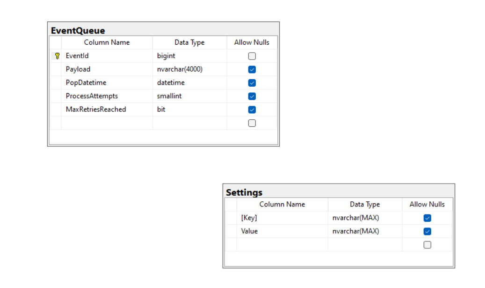
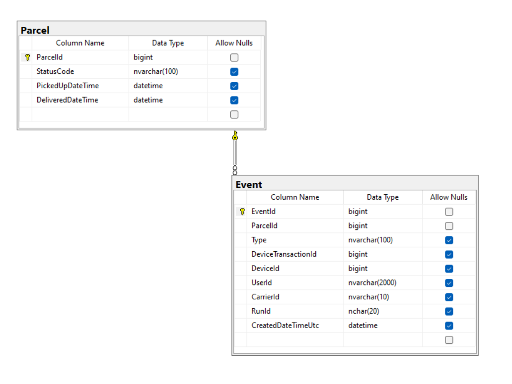

# Welcome to Scan Event

### Miro board

> [Miro board link](https://miro.com/app/board/uXjVNT4IwUc=/?share_link_id=95267939321)

### Prerequisites 
Make sure you have these installed:
- Visual studio preferably 2022 
- .Net 7
- Sql lite studio if you want to have a look inside the db

### Installation
> dotnet restore

##### To run a project from the command line you can use:
> dotnet run --project YourWorkerServiceProjectName.csproj

### Events Queue Database

### Parcel Database

